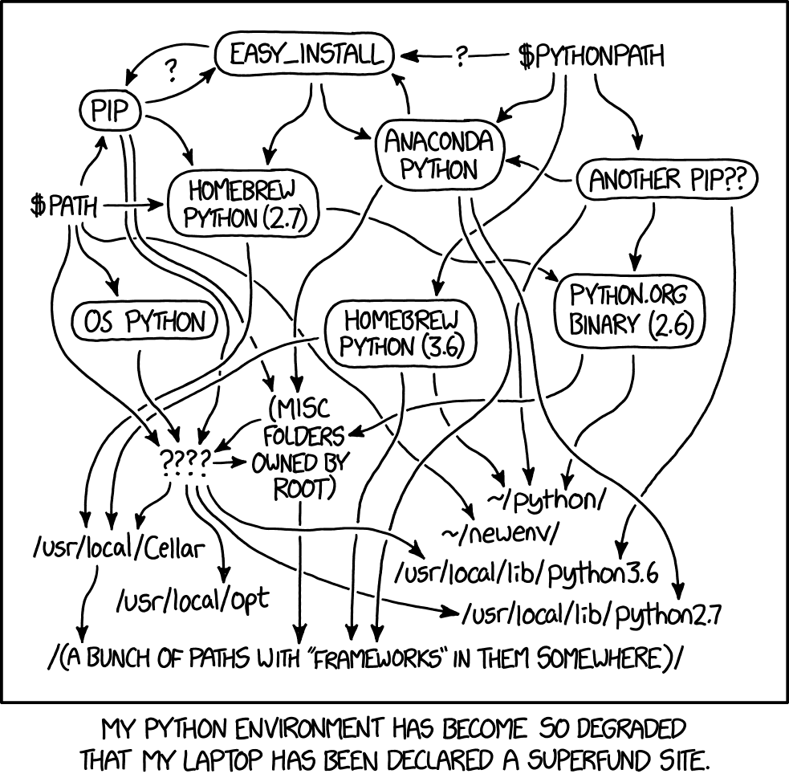

# Tutorial - Setting Up a Python Project with Poetry


Source: [xkcd](https://xkcd.com/1987/)

In this tutorial, you will be guided through the process of setting up a Python project using the `poetry` package manager. The goal is to create a well-structured project that is easy to maintain and share with others (i.e., avoid "dependency hell", see picture above).
This tutorial is divided into three parts:
Part I - Installation: install Python, Git, and Poetry on your system (required for Part II and Part III).
Part II - Creating the Environment: create a new project using poetry to manage dependences, modify the `pyproject.toml` file, install dependencies, and run a Jupyter notebook.
Part III - Cloning an existing poject (created using poetry): cloning the project, installing dependencies using poetry and the pyproject.toml file.

## Part I - Installation

In this section, you will install the necessary tools to create and manage Python projects using Poetry. This is necessary for the subsequent parts of the tutorial.
If you already have Python, Git, and Poetry installed, you can skip this section.

### Install Python

First, ensure that Python is installed on your system. In this tutorial, we will use Python 3.11.9. You can download it from the official website:

[Download Python 3.11.9](https://www.python.org/downloads/release/python-3119/)

During installation, make sure to:

- Check the box that says **"Add Python to PATH"**.
- *(Windows only)* Check the box that says **"Disable path length limit"**.

### Install Git

Git is a version control system that allows you to track changes in your codebase and collaborate with others.

Download and install the latest version of Git for your operating system from:

[Download Git](https://git-scm.com/downloads)

### Install Poetry

Poetry is a package manager for Python that simplifies dependency management and project structure. More information can be found on the official website:

[Poetry Official Website](https://python-poetry.org/)

#### Windows (PowerShell)

Open PowerShell (run as Administrator) and execute the following command:

```bash
(Invoke-WebRequest -Uri https://install.python-poetry.org -UseBasicParsing).Content | py -
```

If you installed Python via the Microsoft Store, replace `py` with `python` in the command above.

Add Poetry to your PATH (on Windows add `APPDATA%\Python\Scripts` to the PATH environment variable). See image below:


#### Linux, macOS, Windows (WSL)

Run the following command:

```bash
curl -sSL https://install.python-poetry.org | python3 -
```

Add Poetry to your PATH (on Linux and macOS, add `$HOME/.local/bin` to the PATH environment variable).

##### Verify the Installation

**Restart** your terminal and check if Poetry is installed correctly by running:

```bash
poetry --version
```

You should see the version of Poetry installed, e.g., `Poetry (version 2.0.1)`.

---

## Part II - Creating the Environment

The goal of this section is to set up a virtual environment for your Machine Learning (ML) projects. Using Poetry, you can manage dependencies effectively, ensuring consistency across different systems and facilitating project sharing. This section is based on the official [Poetry Basic Usage Guide](https://python-poetry.org/docs/basic-usage/).

### Step 1: Create a New Project or initialising a pre-existing project

If you want to create a *new* project, navigate to your desired project directory and run:

```bash
poetry new ml-poetry
```

This command creates a project structure like this:

```
ml-poetry
├── pyproject.toml
├── README.md
├── src
│   └── ml-poetry
│       └── __init__.py
└── tests
    └── __init__.py
```

If you want to initialise a *pre-existing* project, navigate to the project directory and run:

```bash
poetry init
```

This will guide you to interactively create a pyproject.toml file in directory pre-existing-project.

### Step 2: Modify the `pyproject.toml` File

Open `pyproject.toml` in a text editor and add the following at the end:

```toml
[tool.poetry]
package-mode = false
```
If [tool.poetry] is already defined, simply add "package-mode = false" under it.

This ensures the project is treated as a standalone environment rather than a package.

[**Optional**]

Poetry creates a virtual environment in a default directory that depends on your OS.
If you want to change the location of the virtual environment, run the following command in the terminal:

```bash
poetry config virtualenvs.in-project true
```

This tells Poetry to create the virtual environment inside a *.venv* directory in your project folder.

### Step 3: Install Dependencies

For our ML projects, we will install the following essential libraries:

- `numpy`
- `pandas`
- `matplotlib`
- `scikit-learn`
- `seaborn`

Run the following command to install them:

```bash
poetry add numpy pandas matplotlib scikit-learn seaborn ipykernel
```

Poetry will automatically manage dependencies and create a virtual environment for the project.
Additional dependences can be added using again the `poetry add` command at later stage.

### Step 4: Create a test project

In Visual Studio Code (PyCharm instructions are below), create a new jupyter notebook (.ipynb file) in the `ml-poetry` folder.

As interpreted, select the Python interpreter from the virtual environment created by Poetry. To do this:

- Open the terminal in Visual Studio Code.
- Run the command `poetry env info` to get the path to the virtual environment.
   - If it doesn't work, try restarting Visual Studio Code.
- Use the command ctl+shift+p to open the command palette (on macOS, it's cmd+shift+p).
- Type "Python: Select Interpreter" and select the option.
- Click on "Enter interpreter path or browse" and paste the path to the virtual environment.
- Select the Python interpreter from the virtual environment.
- Open a terminal, and you should see the name of the virtual environment in the terminal prompt.
   - otherwise, you can run the command `poetry shell` to activate the virtual environment.
   - then `code .` to open Visual Studio Code.

### Step 5: Run the Jupyter Notebook

In the Jupyter notebook, import the libraries and run some basic code to ensure everything is set up correctly.

```python
import numpy as np
import pandas as pd
import matplotlib.pyplot as plt

# Create a sample dataset
data = {
    'x': np.arange(10),
    'y': np.random.randint(0, 10, 10)
}
df = pd.DataFrame(data)

# Plot the data
plt.plot(df['x'], df['y'])
plt.xlabel('X-axis')
plt.ylabel('Y-axis')
plt.title('Sample Plot')
plt.show()
```

## Part III - Installing dependencies using poetry and the pyproject.toml file

**NOTE**: you can test this section with the files provided in the folder "Test_Poetry_Part_III".

The goal of this section is to show how to install dependencies using poetry and the `pyproject.toml` file.
The typical scenario is when you clone a project from a repository that already has a `pyproject.toml` file with dependencies listed in it and you want to install them on a new machine.
Requirements: Git, Python and Poetry installed on your machine (see [Part I](#part-i---installation)).

1. Clone the Project

Clone the project that you want to run from its repository using Git (if you just want to test poetry, you can use the files provided in the folder "Test_Poetry_Part_III" and skip to the step 2).
For example, to clone a project from GitHub, run:

```bash
git clone <repository-url>
```

2. Navigate to the Project Directory.

Navigate to the project directory using the `cd` command:

```bash
cd <project-directory>
```

You should have the `pyproject.toml` file in the project directory.

3. Install Dependencies

Run the following command to install the project dependencies using Poetry:

```bash
poetry install
```

Poetry will read the `pyproject.toml` file and install the required dependencies in a virtual environment. Additional configuration are possible (such as the location of the virtual environment). For more information, see the [Poetry documentation](https://python-poetry.org/docs/configuration/#virtualenvsin-project).

NOTE: if you want to use VS Code, **do not close** the terminal after running the command. Instead, run the following command to open directly the project in Visual Studio Code:

```bash
code .
```
This will make *much easier* for Visual Studio Code to recognize the virtual environment created by Poetry (you will find more instructions in the next section).

**That's it!** You have successfully installed the project dependencies using Poetry. Of course, you should also run the project to ensure everything is working as expected.
To add new dependencies to the project, you can use the `poetry add` command followed by the package name.

4. Run the Project on Visual Studio Code
   
    4.1 Open Visual Studio Code and navigate to the project directory.
   
    4.2 Type `Ctrl+Shift+P` to open the command palette (on macOS, it's `Cmd+Shift+P`).
   
    4.3 Type "Python: Select Interpreter" and select the option.
   
    4.4 Click on "Enter interpreter path or browse" and paste the path to the virtual environment (to get the path to the virtual environment, in a terminal, run the command `poetry env info`).
   
    4.5 Select the Python interpreter from the virtual environment (Windows: the `python.exe` file should be in the `Scripts` directory; MacOs, the path to the interpreter should be in the `bin` directory (*to be tested*)).
   
    4.6 Restart Visual Studio Code.
   
    4.7 Open a terminal in Visual Studio Code, and you should see the name of the virtual environment in the terminal prompt or among the list of interpreters. If the new environment is not visible, try to type `code .` in your terminal. If it is still not showing up, repeat steps 4.2 to 4.7. You should see a new environment tagged as "Virtual Env" (see below): 
   
    4.8 Run the project in Visual Studio Code to ensure everything is working correctly. The first time you run the project, it may be a bit slow.

5. Run the Project on PyCharm (for a compelte guide see [Configure a Poetry environment](https://www.jetbrains.com/help/pycharm/poetry.html))
   
    5.1 Open PyCharm and navigate to the project directory. To create a new virtual environment go to point 5.2. To reuse an existing virtual environment go to point 5.3.
   
    5.2 The first time you open the project, PyCharm will ask you to select the path to the poetry executable. This is the same path that your added to the PATH environment variable during the installation of Poetry. On Windows, it is typically `C:\Users\<username>\AppData\Roaming\Python\Scripts\poetry.exe`. On Linux and macOS, it is typically `$HOME/.local/bin/poetry`.
   
    Attention, if you clicl "Ok", this will create a **new** virtual environment. This will create a new environment based on the `pyproject.toml` file. You can see the environment in the project settings under "Python Interpreter".  To use an existing environment on your machine, click on "Cancel". You can set the path to the poetry executable later in the project settings under "Python Interpreter":
   
    
   
    5.3 The first time you open the project, PyCharm will ask you to select the Python interpreter. Click on the "Configure Python Interpreter" link. "Add new interpreter" and slect "Add Local Interpreter...". Choose "Select existing" and as "Poetry" as type.
   
    5.3 This will create a new environment based on the `pyproject.toml` file. You can see the environment in the project settings under "Python Interpreter". Now, you need to enter two paths.
   
        5.3.1 "Path to poetry" is the path to the poetry executable. This is the same path that your added to the PATH environment variable during the installation of Poetry. On Windows, it is typically `C:\Users\<username>\AppData\Roaming\Python\Scripts\poetry.exe`. On Linux and macOS, it is typically `$HOME/.local/bin/poetry`. In the field "Poetry env use", enter the path to the virtual environment.
       
        5.3.2 "Poetry env use" is the path to the virtual environment. To get the path to the virtual environment, in a terminal, run the command `poetry env info`. You can copy the path to the virtual environment and paste it in the field "Poetry env use". After step 5.3.2, your configuration should look like this:
   
    
   
    5.4 Wait for the indexing to finish. You can see the progress in the lower right corner of the PyCharm window. This may take a few minutes.
   
    5.5 Run the project in PyCharm to ensure everything is working correctly. The first time you run the project, it may be a bit slow.
